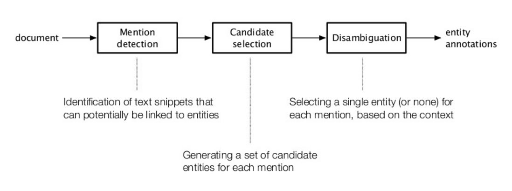
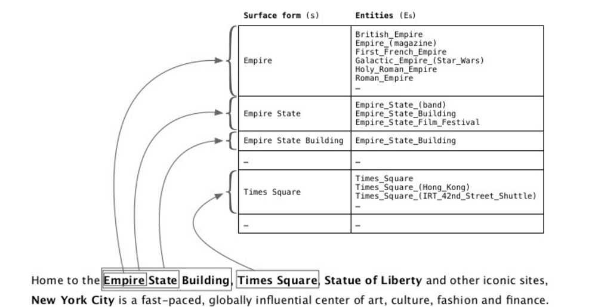
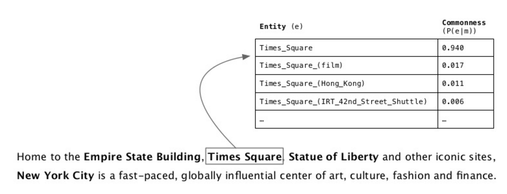

## Entity Linking

In natural language processing, **entity linking**, *named entity linking (NEL)*, *named entity disambiguation (NED)*, *named entity recognition and disambiguation (NERD)* or *named entity normalization (NEN)* is the task of determining the identity of entities mentioned in text. More precise, it is the task of linking entity mentions to entries in a knowledge base (e.g., DBpedia, Wikipedia)

Entity linking requires a knowledge base containing the entities to which entity mentions can be linked. A popular choice for entity linking on open domain text are knowledge-bases based on Wikipedia, in which each page is regarded as a named entity. NED using Wikipedia entities has been also called wikification (see Wikify! an early entity linking system] ). A knowledge base may also be induced automatically from training text or manually built.

NED is different from named entity recognition (NER) in that NER identifies the occurrence or mention of a named entity in text but it does not identify which specific entity it is

### Examples

Example 1:

For example, given the sentence "Paris is the capital of France", the idea is to determine that "Paris" refers to the city of Paris and not to Paris Hilton or any other entity that could be referred as "Paris".

Example 2:

Give the sentence "In Second Debate, Donald Trump and HIllary Clinton Spar in Bitter, Personal Terms", the idea is to determine that "Donald Trump" refer to an American politician, and "Hillary Clinton" refer to 67th United States Secretary of State from 2009 to 2013.

## Architecture

* *Mention detection*: Identification of text snippets that can potentially be linked to entities
* *Candidate selection*: Generating a set of candidate entities for each mention
* *Disambiguation*: Selecting a single entity (or none) for each mention, based on the context

### Mention detection

Goal: Detect all "linkable" phrases

Challenges:

- Recall oriented: Do not miss any entity that should be link
- Find entity name variants (e.g. "jlo" is name variant of [Jennifer Lopez])
- Filter out inappropriate ones (e.g. "new york" matches >2k different entities)

#### Common Approach

1. Build a dictionary of entity surface forms

- entities with all names variants

2. Check all document n-grams against the dictionary

- the value of n is set typically between 6 and 8

3. Filter out undesired entities

- Can be done here or later in the pipeline

**Examples**

### Candidate Selection

Goal: Narrow down the space of disambiguation possibilities

Balances between precision and recall (effectiveness vs. efficiency)

Often approached as ranking problem: keeping only candidates above a score/rank threshold for downstream processing.

#### Commonness

Perform the ranking of candidate entities based on their overall popularity, i.e., "most command sense"

**Examples**

Commonness can be pre-computed and stored in the entity surface form dictionary. Follows a power law with a long tail of extremely unlikely senses; entities at the tail end of distribution can be safely discarded (e.g., 0.001 is sensible threshold)

### Disambiguation

Baseline approach: most common sense

Consider additional types of evidence: *prior importance* of entities and mentions, *contextual similarity* between the text surrounding the mention and the candidate entity, *coherence* among all entity linking decisions in the document.

Combine these signals: using supervised learning or graph-based approaches

Optionally perform pruning: reject low confidence or semantically meaning less annotations.

## References

* ["Entity Linking". *wikipedia*](https://en.wikipedia.org/wiki/Entity_linking)
* ["Entity Linking". *Krisztian Balog, University of Stavanger, 10th Russian Summer School in Information Retrieval*. 2016](http://www.slideshare.net/krisztianbalog/entity-linking-65308055)
* ["An End-to-End Entity Linking Approach for Tweets". *Ikuya Yamada, Hideaki Takeda, Yoshiyasu Takefuji*. 2015](http://www.slideshare.net/ikuyamada/an-endtoend-entity-linking-approach-for-tweets)

