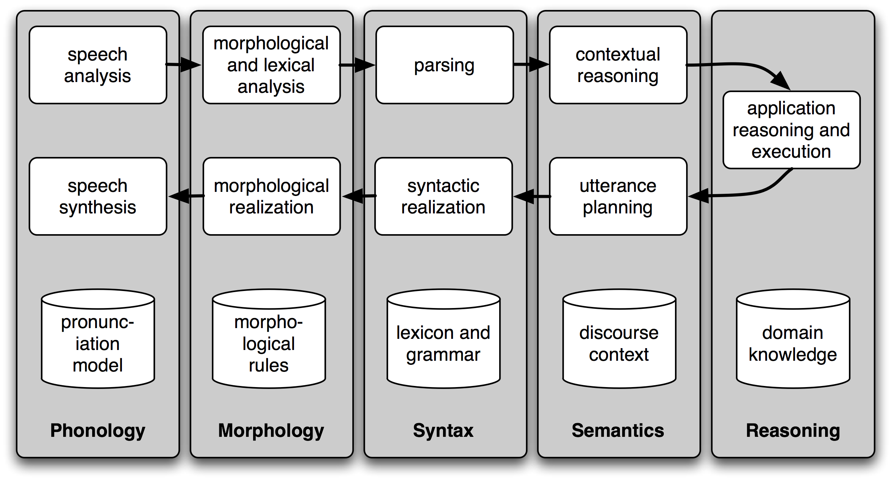

## NLP Tasks

The analysis of natural language is broken into various board levels such as phonological, morphological, syntactic, semantic, pragmatic and discourse analysis.



## Phonological Analysis

Phonology is analysis of spoken language. Therefore, it deals with speech recognition and generation. The core task of speech recognition and generation system is to take an acoustic waveform as input and produce as output, a string of words. The phonology is a part of natural language analysis, which deals with it. The area of computational linguistics that deals with speech analysis is computational phonology

**Example:** [Hans Rosling's shortest TED talk](https://www.youtube.com/watch?v=UNs-ziziPyo)

<table>

<tr>
<td>Original Sound</td>
<td>
<audio controls>
  <source src="https://github.com/magizbox/natural_language_processing/blob/master/docs/sound/Hans_Roslings.mp3?raw=true" type="audio/mpeg">
Your browser does not support the audio element.
</audio>
</td>
</tr>
<tr>
<td class="col-xs-3">Text</td>
<td>
X means unknown but the world is pretty known it's seven billion people have seven stones. One billion can save money to fly abroad on holiday every year. One billion can save money to keep a car or buy a car. And then three billion they save money to pay the by be a bicycle or perhaps a two-wheeler. And two billion they are busy saving money to buy shoes. In the future they will get rich and these people we move over here, these people will move over here, we will have two billion more in the world like this and the question is whether the rich people over there are prepared to be integrated in the world with 10 bilions people.
</td>
</tr>
<tr>
<td>Auto generated sound</td>
<td>
<audio controls>
  <source src="https://github.com/magizbox/natural_language_processing/blob/master/docs/sound/Hans_Roslings_generated.mp3?raw=true" type="audio/mpeg">
Your browser does not support the audio element.
</audio>
</td>
</tr>
</table>

## Morphological Analysis

It is the most elementary phase of NLP. It deals with the word formation. In this phase, individual words are analyzed according to their components called **"morphemes"**. In addition, non-word taken such as punctuation, etc. are separated from words. Morpheme is basic grammatical building block that makes words.


The study of word structure is refereed to as morphology. In natural language processing, it is done in morphological analysis. The task of breaking a word into its morphemes is called morphological parsing. A morpheme is defined as minimal meaningful unit in a language, which cannot be further broken into smaller units.

Example: word *fox* consists a single morpheme, as it cannot be further resolved into smaller units. Whereas word *cats* consists two morphemes, the morpheme "cat" and morpheme "s" indicating plurality.

Here we defined the term meaningful. Though cat can be broken in "c" and "at", but these do not relate with word "cat" in any sense. Thus word "cat" will be dealt with as minimum meaningful unit.

Morphemes are traditionally divided into two types

* (i) "free morphemes", that are able to act as words in isolation (e.g., "thing", "permanent", "local")
* (ii) "bound morphemes", that can operate only as part of other words (e.g., "is" 'ing' etc) The morpheme, which forms the center part of the world, is also called "stem". In English, a word can be made up of one or more morphemes, e.g.,

```
word - thing           -> stem "think"
word - localize        -> stem "local", suffix "ize"
word - denationalize   -> prefix "de", stem "nation", suffix "al", "ize"
```

The computational tool to perform morphological parsing is finite state transducer. A transducer performs it by mapping between the two sets of symbols, and a finite state transducer does it with finite automaton. A transducer normally consists of four parts: **recognizer**, **generator**,  **translator**, and **relator**. The output of the transducer becomes a set of morphemes.

## Lexical Analysis


In this phase of natural language analysis, validity of words according to lexicon is checked. Lexicon stands for dictionary. It is a collection of all possible valid words of language along with their meaning.

In NLP, the first stage of processing input text is to scan each word in sentence and compute (or look-up) all the relevant linguistic information about that word. The lexicon provides the necessary rules and data for carrying out the first stage analysis.

The details of words, like their type (noun, verb and adverb, and other details of nouns and verb, etc.) are checked.


Lexical analysis is dividing the whole chunk of text into paragraphs, sentences, and words.

## Syntactic Analysis

Syntax refers to the study of formal relationships between words of sentences. In this phase the validity of a sentence according to grammar rules is checked. To perform the syntactic analysis, the knowledge of grammar and parsing is required. Grammar is formal specification of rules allowable in the language, and parsing is a method of analyzing a sentence to determine its structure according to grammar. The most common grammar used for syntactic analysis for natural languages are *context free grammar* (CFG) also called *phase structure grammar* and *definite clause grammar*. These grammars are described in detail in a separate actions.


Syntactic analysis is done using parsing. Two basic parsing techniques are: *top-down parsing* and *bottom-up parsing*.

## Semantic Analysis

In linguistics, semantic analysis is the process of relating syntactic structures, from the levels of phrases, clauses, sentences and paragraphs to the level of the writing as a whole, to their language-independent meanings. It also involves removing features specific to particular linguistic and cultural contexts, to the extent that such a project is possible.

The elements of idiom and figurative speech, being cultural, are often also converted into relatively invariant meanings in semantic analysis. Semantics, although related to pragmatics, is distinct in that the former deals with word or sentence choice in any given context, while pragmatics considers the unique or particular meaning derived from context or tone. To reiterate in different terms, semantics is about universally coded meaning, and pragmatics the meaning encoded in words that is then interpreted by an audience

## Discourse Analysis

The meaning of any sentence depends upon the meaning of the sentence just before it. In addition, it also brings about the meaning of immediately succeeding sentence.

Topics of discourse analysis include:

* The various levels or dimensions of discourse, such as sounds, gestures, syntrax, the lexicon, style, rhetoric, meanings, speech acts, moves, strategies, turns, and other aspects of interaction
* Genres of discourse (various types of discourse in politics, the media, education, science, business, etc.)
* The relations between text (discourse) and context
* The relations between discourse and power
* The relations between discourse and interaction
* The relations between discourse and cognition and memory

## Pragmatic Analysis

During this, what was said is re-interpreted on what it actually meant. It involves deriving those aspects of language which require real world knowledge.

### Sentiment Analysis

<a href="https://www.metamind.io/about" target="_blank">MetaMind</a>, @RichardSocher

### Named Entity Recognition

<a href="http://research.microsoft.com/en-us/people/chiw/kdd15tutorial.aspx" target="_blank">KDD 2015 Tutorial: Automatic Entity Recognition and Typing from Massive Text Corpora - A Phrase and Network Mining Approach</a>

### Relationship Extraction

<a href="http://www.alchemyapi.com/api/relation-extraction" target="_blank">AlchemyAPI</a>

## References

* [Kumar, Ela. *Natural Language Processing*. New Delhi: I.K. International Publishing House, 2011](https://www.amazon.com/Natural-Language-Processing-Ela-Kumar/dp/9380578776/ref=sr_1_1?s=books&ie=UTF8&qid=1476086806&sr=1-1&keywords=9789380578774)
* ["Artificial Intelligence Natural Language Processing". _www.tutorialspoint.com_. N.p., 2016. Web. 11 Oct. 2016.](https://www.tutorialspoint.com/artificial_intelligence/artificial_intelligence_natural_language_processing.htm)